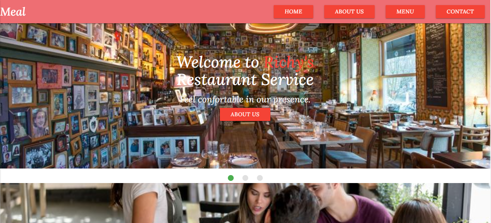
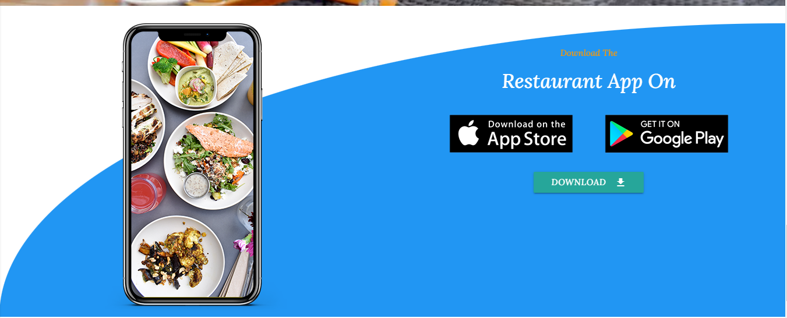

 Restaurant-Page
 This app is a free restaurant template designed with Materialize CSS 

 ## Screenshots
 


## Demo
live demo (https://richmond-andoh.github.io/Restaurant-Page/)

## Run Locally
Clone the project

```bash
  git clone https://github.com/Richmond-Andoh/Restaurant-Page.git
```
Go to the project directory

```bash
  cd my-project
``` 

```


# Support

For support, email richmondandoh00@gmail.com.


# Contributing

Contributions are always welcome!
